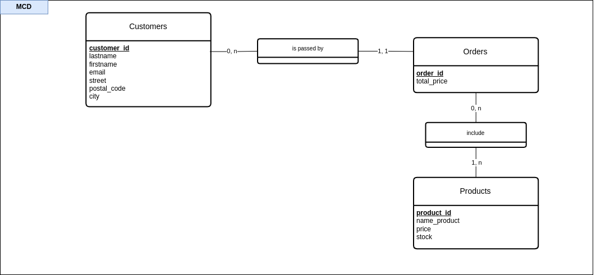
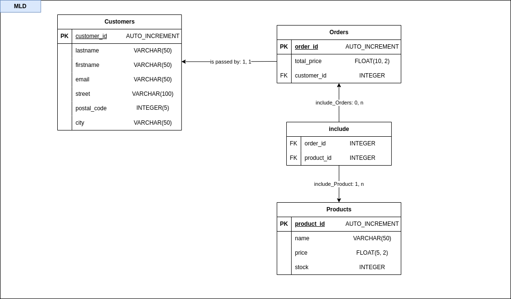

# Conception d'un système d'information d'une Application e-Commerce (TP)

### Objectif :
*L'objectif est de modéliser et de donner une visualisation claire et structurée des données et des processus du système d’information d'une Application e-Commerce.*

## **--- MCD ---**
*Le **Modèle Conceptuel de Données** offre une représenation globale de la structure de données. Il permet de visualiser les **Entités**, qui sont des objets ou concepts du monde réel, et leurs **Attributs**, qui sont les propriétés ou caractéristiques spécifiques à chaque **Entité**. Il illustre également les liens logiques entre chaque **Entité** que l'on appelle les **Relations**. Enfin, on retrouve les **Cardinalités** qui indiquent le nombre minimal et maximal de fois qu'une **Entité** peut être associée à une autre dans une **Relation**.*

### 1. les Entités
**`Customers` :** Chaque client qui passe une commande dans la boutique\
**`Orders` :** Les commandes passées par les clients\
**`Products` :** Les produits disponible dans la boutique

### 2. les Attributs
**`Customers` :** lastname, firstname, email, street, postal_code, city\
**`Orders` :** total_price\
**`Products` :** name, price, stock

### 3. les Relations avec les Entités et Cardinalités
**`Customers (1:N) Orders` :** Un client peut passer au moins une commande, alors qu'une commande est passée par un seul et même client.

**`Orders (N:M) Products` :** Une commande peut inclure plusieurs produits, et un produit peut être inclue dans plusieurs commandes. Pour gérer les multiples liaisons de ces deux entités, une **table d'association** sera donc nécéssaire.

---

## **--- MLD ---**
*Le **Modèle Logique des Données** est une représentation plus précise du **MCD**. Lors de cette transition, les **Entités** sont converties en **Tables**. On précisera les **clés primaires** pour chaque **Table** et on ajoute les **clés étrangères** (dans le cas d'une relation 'one-to-one' ou 'one-to-many'), et les **tables d'association** (dans le cas d'une relation 'many-to-many'), établissent ainsi les liens entre les **Tables** conformément aux associations définies dans le MCD. Le MLD spécifie également les types de données pour chaque attribut (comme VARCHAR, INT, etc.).*

### 1. les Clés Primaires
Pour spécifier qu'un attribut sert de **clé primaire** dans une table, on précisera avec l'abréviation "PK" pour "Primary Key" à côté du nom d'attribut concerné. Elle permet d'identifier de manière unique chaque enregistrement.

**`Customers` :** customer_id\
**`Orders` :** order_id\
**`Products` :** product_id

### 2. les Clés Étrangères
La **clé étrangère** fait référence à la clé primaire d'une autre table, permettant ainsi de créer une relation entre ces tables. Ici, la relation **'one-to-many'**, notée `Customers (1:N) Orders`, nécessite l'insertion de la **clé étrangère** `customer_id` dans la table `Orders`, avec l'abréviation "FK" pour "Foreign Key" à côté du nom d'attribut. Elle est ainsi ajoutée dans la table qui représente le "plusieurs" pour faire référence à l'enregistrement de la table qui représente le "un". 

Dans cet exemple, "Un client peut passer plusieurs commandes", donc le 'plusieurs' est représenté par la Table `Orders`. Cette **clé étrangère** se réfère à la **clé primaire** de la table `Customers`.

### 3. les Tables d'association
Les relations **'many-to-many'**, telles que `Orders (N:M) Products`, exigent l'établissement de **tables d'association**. Elle est créée pour relier chaque commande à plusieurs produits et inversement, afin de faciliter la gestion de ces interactions plus complexe.

Ici, la table d'association `OrdersProducts` (anciennement 'include') contient alors des clés étrangères qui font référence aux clés primaires des deux tables initiales. Dans notre cas, à la Table `Orders` et à la Table `Products`. 

### 4. le Typage des données

Le **typage des données** des attributs spécifie le genre d'informations que chaque attribut peut contenir dans une base de données.\
**Ici nous avons plusieurs types, notamment :**

**INTEGER** : Stocke des nombres entiers

**VARCHAR(n)** : Un type de données pour les chaînes de caractères de longueur variable, où "n" représente la longueur maximale de la chaîne.

**FLOAT(m, n)** : Utilisé pour stocker des nombres réels avec des points décimaux. "m" indique la précision totale et "n" le nombre de chiffres après la virgule. 

**AUTO_INCREMENT** : Principalement pour les clés primaires, ce type incrémente automatiquement la valeur chaque fois qu'un nouvel enregistrement est inséré.

**- Table `Customers`**

| Attribut    | Type de données |
|-------------|-----------------|
| customer_id | AUTO_INCREMENT  |
| lastname    | VARCHAR(50)     |
| firstname   | VARCHAR(50)     |
| email       | VARCHAR(50)     |
| street      | VARCHAR(100)    |
| postal_code | INTEGER(5)      |
| city        | VARCHAR(50)     |

**- Table `Orders`**

| Attribut    | Type de données |
|-------------|-----------------|
| order_id    | AUTO_INCREMENT  |
| total_price | FLOAT(10, 2)    |
| customer_id | INTEGER         |

**- Table `Products`**

| Attribut   | Type de données |
|------------|-----------------|
| product_id | AUTO_INCREMENT  |
| name       | VARCHAR(50)     |
| price      | FLOAT(5, 2)     |
| stock      | INTEGER         |

**- Table d'association `OrdersProducts`**

| Attribut   | Type de données |
|------------|-----------------|
| order_id   | INTEGER         |
| product_id | INTEGER         |

---

## **--- Dictionnaire de données ---**

*Le **Dictionnaire de données** sert à recenser et décrire de manière détaillée tous les éléments de données qui sont utilisés dans un système d'information. Au minimum, un dictionnaire de données est composé d'une colonne **Attribut**, **Type**, **Description** et **Exemple**.*

*Ici, nous avons trouvé pertinent d'ajouter une colonne **Contraintes** pour plus de précision, et avons gardé la colonne **Entité** pour plus de clarté dans la lectures du dictionnaire de données.*

*Ainsi le **dictionnaire de données** sert de référence pour comprendre comment les données sont structurées, stockées et utilisées, en fournissant ainsi des détails essentiels pour les développeurs et les personnes en charge de la gestion du projet.*

---

## **--- MPD ---**

*Le **Modèle Physique de Données** est une représentation détaillée de la base de données qui inclut tous les éléments techniques. Il se concentre sur la manière dont les données seront stockées et sur la spécification des tables, des clés, des contraintes, et des relations entre les tables.*

*C'est l'aboutissement de toute la conception en amont selon la méthodologie Merise.*

*À partir du MPD, des scripts SQL sont générés. Ces scripts inclus des commandes pour créer de tables, définir les clés primaires et étrangères, établir les contraintes d'intégrité (comme les contraintes de non-nullité et d'unicité)* 

Indexation : (...)

---

## **--- Conclusion ---**

*En résumé, dans la conception d'un système d'information via la méthodologie Merise, chaque étape est fondamentale. Le Modèle Conceptuel de Données (MCD) définit les entités et relations, évoluant en un Modèle Logique de Données (MLD) qui précise les tables et liens. Le dictionnaire de données détaille chaque attribut, en assurant la clarté et l'intégrité du système. Finalement, le Modèle Physique de Données (MPD) concrétise cette structure en un script SQL, prêt pour l'implémentation. Maîtriser Merise est crucial pour développer une base robuste et optimisée pour le développement d'applications.*

---